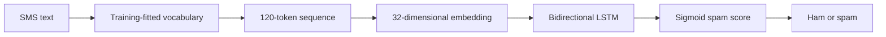

# SMS spam classification with a bidirectional LSTM

[](https://github.com/fatemeh-akbarifar/bidirectional-lstm-sms-classifier/actions/workflows/tests.yml)

A natural-language-processing project that classifies SMS messages as ham or spam using learned word embeddings and a bidirectional long short-term memory (BiLSTM) network. It demonstrates text preprocessing, sequence modeling, class-specific evaluation, and portable inference from raw text.

## Original work

The original notebook implements learned word embeddings, a bidirectional LSTM, and a raw-message prediction function. That notebook is preserved alongside the maintained runnable edition. Numerical results from later maintenance checks are labeled separately.

[Original notebook and evidence](docs/original-work.md). The runnable edition below includes maintenance fixes; new validation numbers are kept separate from historical achievements.

## Run locally

```bash
git clone https://github.com/fatemeh-akbarifar/bidirectional-lstm-sms-classifier.git
cd bidirectional-lstm-sms-classifier
python3 -m venv .venv
source .venv/bin/activate
python -m pip install -r requirements.txt
python sms_classifier.py
```

Use Python **3.9–3.11**; the automated workflow targets Python 3.11. On Windows, activate with `.venv\Scripts\activate`. A first run requires internet access for dependencies and missing datasets. Subsequent runs reuse local data. CPU execution is supported; neural-network training is slower without an accelerator.

Use a Python 3.9–3.11 kernel for the notebook; hosted runtimes with newer Python versions are outside the pinned environment. The verified execution path is the local command line.

Notebook: [sms_classification.ipynb](sms_classification.ipynb). [Open in Colab](https://colab.research.google.com/github/fatemeh-akbarifar/bidirectional-lstm-sms-classifier/blob/main/sms_classification.ipynb).

## Method



1. Download the two supplied freeCodeCamp TSV files.
2. Remove training messages that occur exactly in the supplied evaluation file, and deduplicate remaining training messages. Preserve the supplied evaluation file.
3. Create a stratified 80/20 training/validation split from the cleaned training pool.
4. Fit `TextVectorization` on training text only, with a 12,000-token cap and fixed 120-token sequences. Unseen words use the out-of-vocabulary token; zero padding is masked.
5. Train 32-dimensional embeddings → bidirectional LSTM (64 units per direction, dropout 0.2) → sigmoid output using RMSprop and binary cross-entropy.
6. Select weights using validation loss, then report evaluation accuracy, spam precision/recall/F1, and a confusion matrix.

Class mapping: **0 = ham, 1 = spam**. The default decision threshold is 0.5. Tokenization and vocabulary are embedded in the saved model, so inference accepts raw strings. The fixed sequence length truncates long messages.

## Outputs

`artifacts/` contains `model.keras`, `metrics.json`, `history.json`, and `predictions.csv`. Generated artifacts and downloaded data are ignored by Git. Message text is not included in the exported predictions CSV.

## Maintenance validation (September 2026)

The maintained implementation achieved evaluation **accuracy: 98.06%**, **spam recall: 91.44%**, **spam F1: 0.9268**, after removing exact training/evaluation message overlap. The original seven-example challenge check scored **6/7** at the default threshold; see the report for the false negative.

See [the reproducibility report](docs/validation.md) for measured results, commands, environment, and the limits of validation.

## Predict a message

```bash
python sms_classifier.py --model artifacts/model.keras --message "Are we still meeting tomorrow?"
```

The result is `[spam_probability, "ham" or "spam"]`. Empty messages are rejected.

## Tests

```bash
python -m pip install -r requirements-dev.txt
python -m pytest -q
```

The included GitHub Actions workflow runs focused tests, including saved-model round trips where applicable. It does not retrain the full dataset on every push.

## Limitations

This is an educational classifier on a historical SMS dataset, not a production spam filter. Exact-message overlap is removed from training, but near-duplicates can remain and the evaluation set may itself contain repeated messages. Reported metrics are specific to this split and seed. Spam recall matters alongside accuracy because the classes are imbalanced. Sigmoid outputs are not calibrated confidence estimates.

## Project background and attribution

Developed by **Fatemeh Akbarifar** as part of freeCodeCamp's Machine Learning with Python projects. This repository packages and modernizes the original implementation with reusable Python entry points, dependency pins, tests, and reproducible evaluation. [Engineering notes](docs/engineering.md) distinguish original work from the reproducibility improvements.

- [freeCodeCamp project starter](https://github.com/freeCodeCamp/boilerplate-neural-network-sms-text-classifier)
- [Dataset used by the project](https://cdn.freecodecamp.org/project-data/sms/train-data.tsv)

The challenge design and supplied datasets are external resources; their original terms apply. No new dataset ownership or certification claim is made here.
